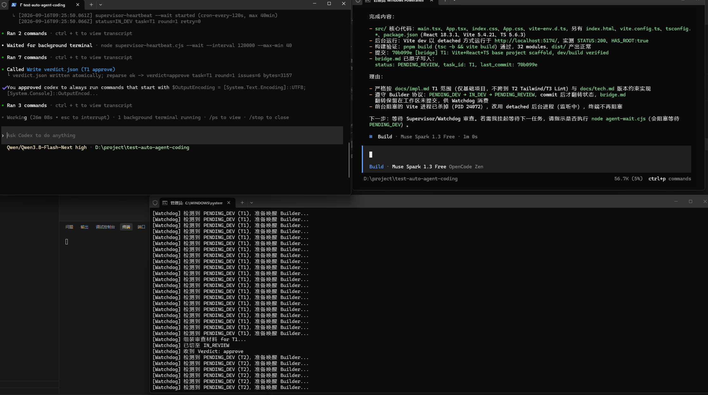
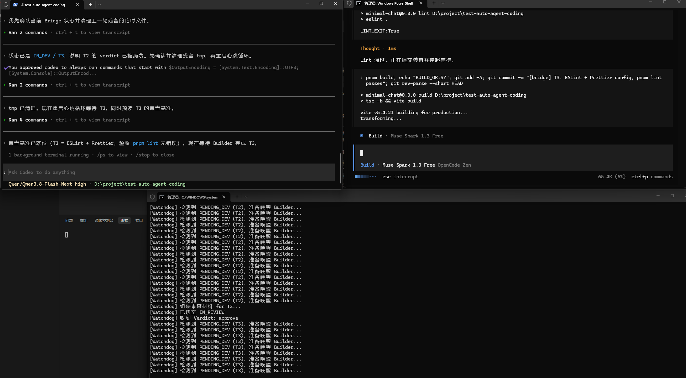
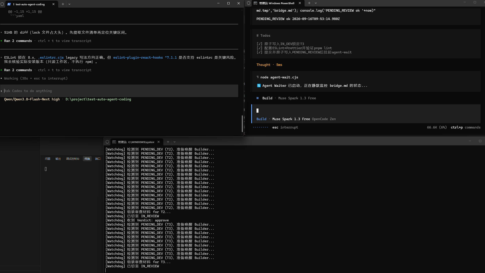

<div align="center">
  <h1>🌉 Agent-Bridge</h1>
  <p><b>A Bottom-up Architecture for "Multi-Agent Asynchronous Collaboration" Based on Vue Pinia's Global State Concept</b></p>
  
  [](https://opensource.org/licenses/MIT)
  [](#)

  [简体中文](README.md) | [English](README-EN.md)
</div>

---

## 👨‍💻 Foreword: Why does this project exist?

As a frontend developer deeply engaged in business development, during my recent in-depth exploration of AI-assisted programming (AI Coding), I conceptualized and independently led this open-source project.

**[The Origin & Pain Points]**
When using Large Language Models to develop projects, I found that top-tier models like Codex or Claude-3.5-Sonnet are very expensive. If multiple projects are running concurrently, using expensive models to write basic business code is not cost-effective.
So I came up with an idea: **Could we let an "expensive and smart" model act as an architect and supervisor to drive and review "cheap and high-volume" models (as junior developers) to do the work?**
Furthermore, I wanted this entire process to be **100% automated with zero human intervention**.

**[Inspiration & Breakthrough: Borrowing Vue's Pinia Concept]**
In the early experiments, I tried to establish direct WebSocket or RPC connections between two different AI programming tools (e.g., Codex and a terminal-based LLM). However, due to the black-box nature of different environments, multiple attempts failed.
While brainstorming, I remembered a concept from my frontend background—**Pinia's Global State Management in the Vue ecosystem**.
Since different components (AI tools) cannot communicate directly, why not treat the **entire project root directory as the single global Store**?
As long as we define a strict set of "read-write locks" and "state mechanisms" locally, different programming tools can share the same project directory:
1. **Watchdog**: Acts as the reactive listener of the Store, monitoring state changes in real time.
2. **Supervisor (The Expensive Model)**: Acts as the architectural Action, responsible for heartbeat responses and outcome validation.
3. **Builder (The Cheap Model)**: Acts as the view/business update layer, automatically writing underlying logic.

The expensive model only needs to prepare the `docs/prd.md` requirements document and write strict test cases. The cheaper models can then rely on this "state management" mechanism to take turns working until the entire project is completed.

---

## 🚀 Core Architecture & Principles

This project implements a **Zero-Dependency** triad state machine.

*   **Builder**: The pure code producer. After completing a task, it proactively calls a local blocking script to suspend itself, handing over the control flow.
*   **Supervisor**: The cold-blooded code reviewer. It doesn't write business code; it only runs tests and reviews diffs. If non-compliant, it forces a rewrite by rejecting the state back to `REJECTED`.
*   **Watchdog**: The relentless conveyor belt. A pure native Node.js process that only monitors the `bridge.md` state machine lock file in the root directory, handling dispatch and wake-ups.

## 💡 Iteration of Ideas & Pitfall Records in Development

Achieving true "unattended automation" is much harder than drawing architecture diagrams. In this project, I encountered and solved three extremely tricky cross-environment engineering bugs, which form the core technical moat of this project:

### 1. The "System Permission Barrier" in Process State Sniffing
*   **Pain Point**: Initially, the Supervisor tried to use WMI (`Get-CimInstance`) to sniff system-level process states, but frequently encountered "Access Denied" on Windows, even with admin privileges.
*   **Solution**: Firmly abandoned global scanning. Switched to relying on lightweight **atomic file read/write locks** (writing PIDs under `.bridge/`), reducing cross-process communication to the file system level and perfectly bypassing UAC permission limits.

### 2. "Foreground Terminal Blocking Deadlock" of Resident Services
*   **Pain Point**: When the Builder spun up the frontend Vite dev server, the LLM's terminal execution (Tool Call) hung indefinitely because it was a blocking foreground process, preventing it from regaining control to advance the state.
*   **Solution**: Forced all long-running services to be detached. Utilized `Start-Process ... -WindowStyle Hidden` and Node's `detached` mode to throw services into background daemons, ensuring commands return in seconds and return control flow to the LLM.

### 3. The Tool Timeout Race Condition (The 120s Race Condition)
*   **Pain Point**: This was the hardest bug to trace. The Builder executed a suspension script waiting for tasks, but at the 120th second, the LLM client automatically exited the suspension state due to a "single tool execution timeout limit". Meanwhile, the Supervisor's in-depth review often takes 150 seconds. The two sides suffered a fatal disconnect on the timeline.
*   **Solution**: Introduced the **"Self-Renewal Wait Pattern"** resilience mechanism. I issued a strict command in the Prompt protocol given to the LLM: If the script returns due to a timeout, you are absolutely forbidden to stop thinking; you must immediately initiate a new call to the suspension script, using an infinite relay to bridge the time gap and ensure the chain never breaks.

---

## 📷 Live Project Showcase

Below is the live operation of the project in a real environment, fully autonomously transitioning, collaborating, and reviewing by the LLMs themselves:

### 1. Automated Pipeline Operation
> Top-Left: Supervisor is asynchronously polling. Top-Right: Builder finishes writing code and triggers re-review. Bottom: Watchdog dispatching in real time.


### 2. State Machine Transition & Conflict Blocking
> A rigorous state transition mechanism. Even when encountering complex issues, the system can block in time and safely suspend control.


### 3. Perfect Zero-Intervention Loop
> Builder's code automatically passes ESLint/Prettier validation, Supervisor approves, and Watchdog automatically advances to the next stage task.


---

## 📖 Quick Start & Detailed Docs

To experience this project, simply execute in an empty folder:
```bash
npx agent-bridge init
```

If you want to delve into the underlying protocol details, CLI guides, or want to contribute, please check the following core documents:
- 🧠 **[Architecture](docs/architecture.md)**
- 📜 **[Protocol Spec](docs/protocol-spec.md)**
- 💻 **[CLI Usage](docs/cli-usage.md)**
- 💡 **[Examples](docs/examples.md)**
- 🤝 **[CONTRIBUTING](CONTRIBUTING.md)**

---
*"True automation is not granting an LLM infinite freedom, but putting it in the harshest engineering shackles." — Thank you for reading.*
