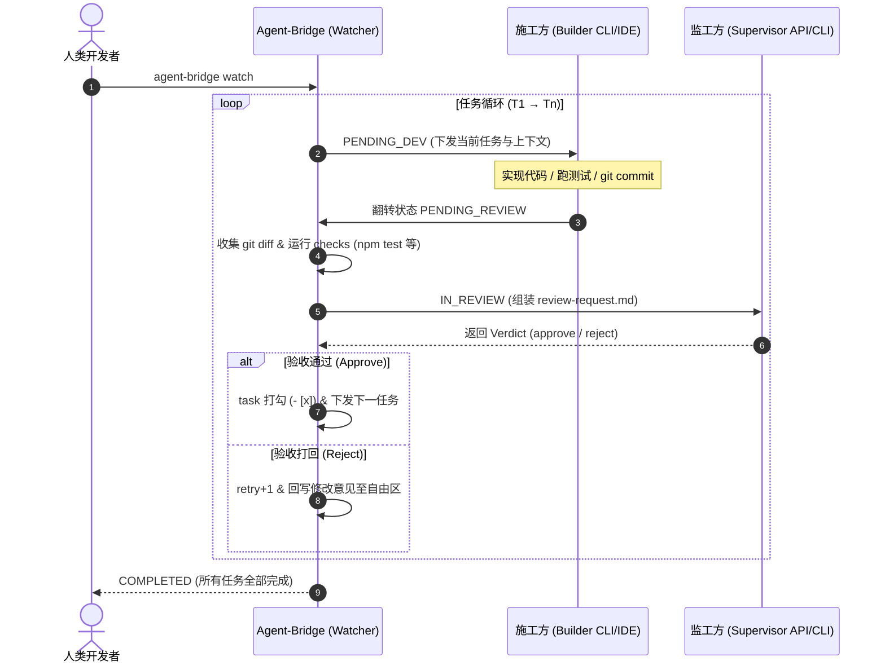

# 🚀 Agent-Bridge (Meta-Agent 协同调度引擎)

[English](./README_EN.md) | 简体中文

> **"不要让大模型直接写全量代码，让大模型当架构师验收代码。"**
> 
> Agent-Bridge 是一个极客级的元智能体调度器与命令行工具（CLI）。它打通了各类异构底层开发智能体（如 Claude Code CLI、Cursor、WorkBuddy 等），建立起基于标准文件状态机的**全自动双 Agent "左脚踩右脚"协同流水线**。

---

## 🌟 核心理念与架构

传统的多 Agent 框架（如 AutoGen、MetaGPT）往往试图全盘接管所有行为，导致逻辑臃肿、幻觉累加。Agent-Bridge 的核心是**将开发与验收职责彻底解耦**：

- **施工方（Builder）**：专注于当前具体的单一编码任务，编写代码并通过本地自动化测试。
- **监工方（Supervisor）**：扮演苛刻的架构师/CTO，只依据真实 `git diff`、终端校验日志和需求规范进行代码审查，给出纯 JSON 格式的通过/打回指令。
- **桥接器（Agent-Bridge）**：作为唯一的总调度引擎守护进程，通过原子文件读写、超时强杀、截断降级与熔断机制，守护开发闭环。



---

## ⚡ 15 分钟快速上手

### 1. 全局安装或在项目中使用
```bash
# 全局软链或安装
npm install -g agent-bridge

# 或在项目根目录下直接使用
npx agent-bridge --help
```

### 2. 初始化项目结构
在一个新的或已有 Git 仓库中执行初始化：
```bash
agent-bridge init
```
该命令会自动生成以下标准骨架（已有文件默认跳过不覆盖，`--force` 可强制覆盖）：
- `docs/`：`prd.md`（需求）, `tech.md`（技术规范）, `impl.md`（任务清单）, `test.md`（测试标准）
- `agents/`：`supervisor.md`（监工规范）, `builder.md`（施工规范）
- `prompts/`：`builder-cli.md`, `builder-loop.md`, `supervisor-loop.md`
- `bridge.md`：协同状态机文件
- `.bridge.config.json`：引擎配置文件

### 3. 配置密钥与运行模式
在 `.bridge.config.json` 中配置你的 Agent：
```jsonc
{
  "supervisor": {
    "mode": "api",                   // api | cli | watch
    "provider": "claude",            // claude | openai (兼容 DeepSeek/通义)
    "model": "claude-sonnet-4-5",
    "apiKey": "${ANTHROPIC_API_KEY}"
  },
  "builder": {
    "mode": "cli",                   // cli (Mode A 无头) | watch (Mode B IDE 定时)
    "command": "claude",
    "args": ["-p", "{promptFile}"],
    "timeoutMin": 45
  },
  "checks": ["npm run build", "npm test"],
  "pollIntervalSec": 5,
  "maxRetryPerTask": 5,
  "onMaxRetry": "human"             // human (人工干预) | skip (跳过继续)
}
```

### 4. 启动与调度
```bash
# 启动守护进程，进入全自动循环
agent-bridge watch

# 或单步调试执行（仅执行当前半循环一次）
agent-bridge once --dry-run

# 查看当前任务进度与状态
agent-bridge status

# 人工处理完问题后恢复流水线
agent-bridge resolve
# 或跳过阻断任务
agent-bridge resolve --skip
```

---

## 📋 智能体接入矩阵

| 模式 | 运行方式 | 适用工具 | 特性说明 |
|---|---|---|---|
| **Mode A (CLI 驱动)** | 桥接器主动 spawn 无头子进程 | Claude Code CLI, Cursor Agent CLI | 全自动隔离，进程级超时强杀，支持 `{promptFile}` 规避命令行长度限制 |
| **Mode B (IDE 兼容)** | IDE 侧注册会话定时任务 | WorkBuddy, Antigravity IDE | 状态文件轮询驱动，容错读取半写入文件，迟到裁决自动过滤 |
| **Mode API (监工专享)**| 直接调用大模型 SDK | Claude, OpenAI, DeepSeek, 通义千问 | 指数退避重试（429/5xx），Token 消耗全局统计，非法 JSON 自动重问一次 |

---

## 🧪 自证实验指标与实测报告

基于 `plan.md §7` 定义的自证基准，我们在包含 5 个阶段任务的 `examples/todo-app` 中进行了无人工干预的真实协同运行测试：

| 指标维度 | 设定阈值 | 实测表现 | 结论 |
|---|---|---|---|
| **任务完成率** | 5 / 5 (100%) | **5 / 5 (全部打勾通过)** | ✅ 达标 |
| **人工干预次数** | 0 次（出现 NEEDS_HUMAN 即失败） | **0 次** | ✅ 完美达标 |
| **总循环轮次** | ≤ 15 轮 | **5 轮 (一次性无打回通过)** | ✅ 远优于基准 |
| **自动化 Checks**| 100% 全绿 | **100% 全绿** | ✅ 达标 |
| **自愈恢复能力**| 模拟进程中断与陈旧状态 | **断点续跑成功自愈** | ✅ 达标 |

---

## 🛡️ 安全与已知限制

1. **供应链与代码执行风险**：验收管线会自动执行施工智能体编写的代码与测试。严禁在未经沙箱隔离的生产环境直接使用本工具，强烈建议在 Docker / 虚拟机容器内运行。
2. **命令行长度溢出**：Windows 系统的命令行存在约 8191 字符的长度限制。配置子进程参数时，请务必使用 `{promptFile}` 代替 `{prompt}`。
3. **API 成本控制**：由于具备 `maxRetryPerTask` 熔断机制与 Token 自动审计日志，系统不会发生无限死循环；但仍建议在各 Provider 平台端配置单日预算警报。
4. **Git 历史管理**：施工方每轮提交均带有 `[bridge]` 前缀，建议在独立的功能分支中运行，完成全部任务后由人类开发者进行 Squash 合并。

---

## 📄 开源许可证

本项目基于 [MIT 许可证](LICENSE) 开源。
